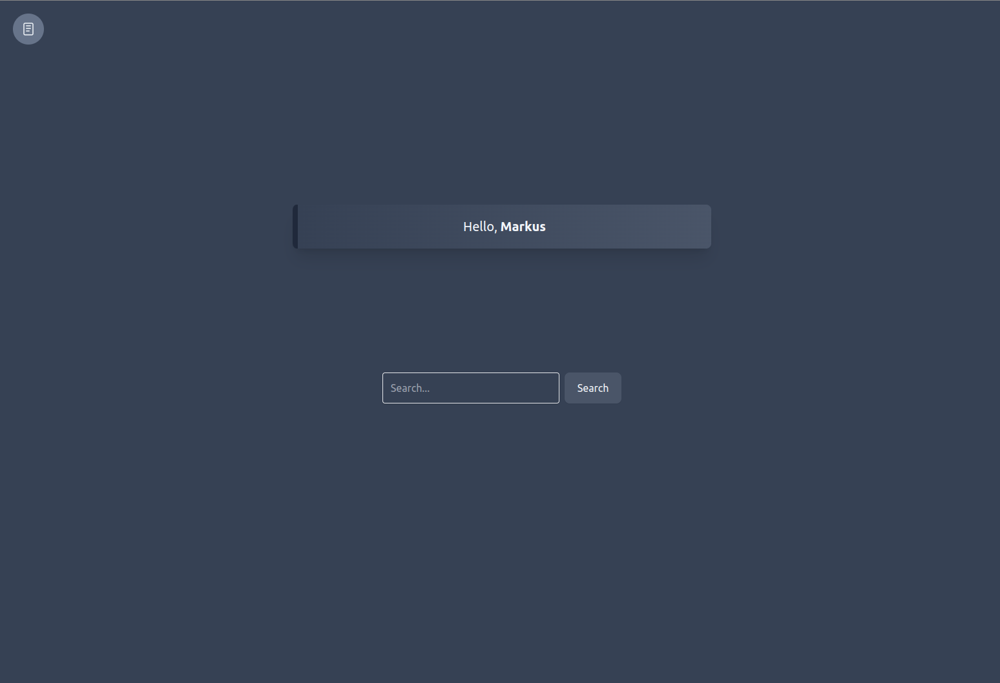
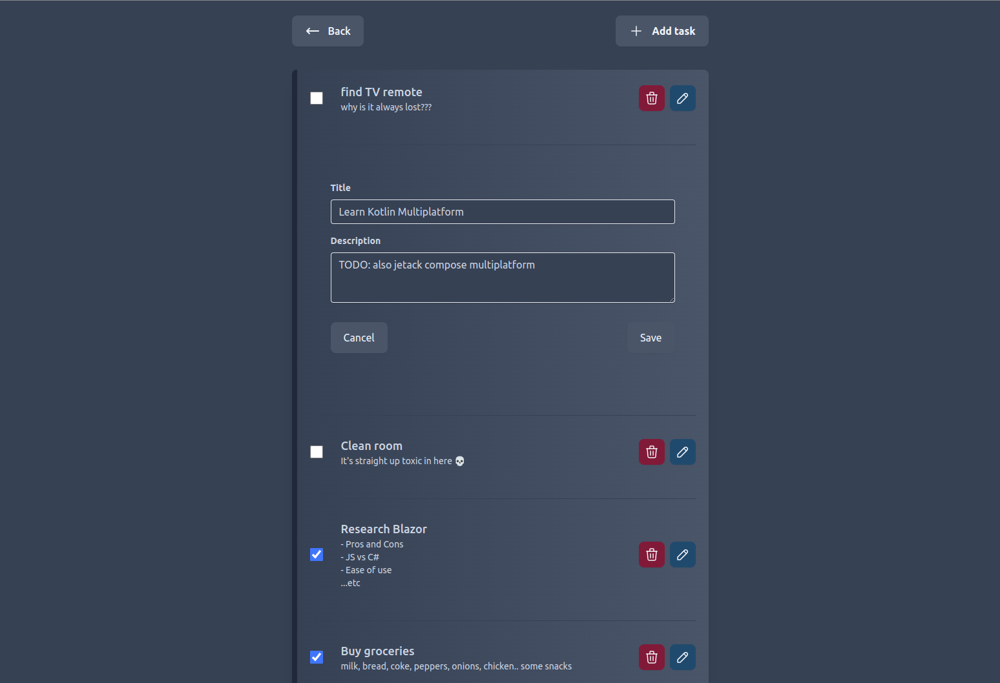

# WebAssembly Dashboard/Notes
Very simple Dashboard/Todo app built with Blazor WebAssembly

Meant to showcase:
- Basic usage of Blazor with a C# .NET Web Api.
- Shared frontend/backend codebase (eg. shared types/classes)
- Basic CRUD operations and API calls
- Razor Components common usage cases
- Calling JS functions from C#


Other:
- Because it's only a usage showcase, there's no persistent storage/database. All notes is list upon server restart.
- Uses Tailwind CSS for styling
- [Tabler icons](https://tablericons.com/)

## Development

In the root folder

Start Blazor:
```bash
dotnet watch run --non-interactive --project Client
```

Start Server
```bash
dotnet watch run --non-interactive --project Server
```

Built on Linux ;). `--non-interactive` is required for hot-reload to properly watch for changes *for now*.

## Pictures



